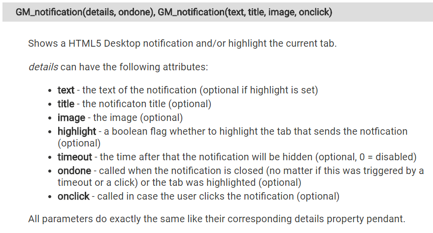
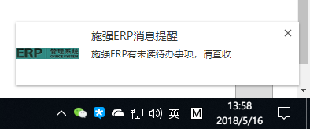
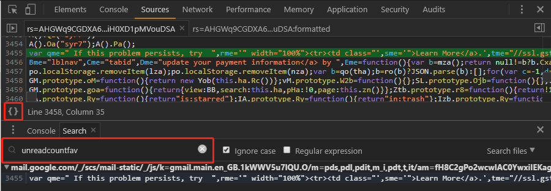
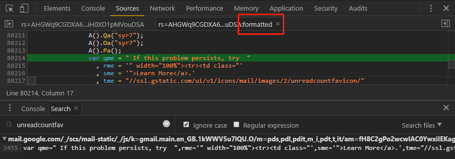

<!-- $theme: gaia -->

如何对现有ERP系统进行消息提醒增强
===

## 需求
> 周一开前端周会前，ERP系统其实已经发出了“会议信息”的提醒，因为没有刷新ERP首页，导致在开会前没有看到这个消息。如何让同事能及时看到这条消息呢？

---

## 可选方案
- 刷新页面？
- 修改项目代码？
- 发短信？
- ERP系统发出会议提醒后，再使用其他社交工具通知？或者直接走过去通知？
......

---


### 对可选方案的反思
- 有没有一种对前端友好，成本很低的方案？
- 有没有一种方案，让任意一个懂js的人，基于浏览器，半个小时以内就可以实现这个需求？

---


## 分析现有代码
````javascript
<li style="clear: left;" class="h_new" id="h_new">
    <a href="/PC/Todo/TodoList" class="h_new_msg" navid="h_todo" navtitle="待办事项" id="h_todo">
        待办
        <span><span class="head-sign" id="h_todo_count">0</span></span>
    </a>
    <a href="/PC/Remind/RemindList" class="h_new_msg" id="h_remind" navid="h_remind" navtitle="提醒事项">
        提醒
        <span><span class="head-sign" id="h_remind_count">0</span></span>
    </a>
    <a href="/ServiceWebMail/WebMail/SSOLogin" title="username@cnstrong.cn" target="_blank" id="h_email">
        邮件
        <span id="spEmail"><span class="head-sign" id="h_email_count">0</span></span>
    </a>
</li>
````
---
###### 分析现有代码

````javascript
$(function(){
    // 如果符合条件，弹出提示
    if ($.browser.msie && $.browser.version < 7)
    {
        $('#hShowAlert_ie6').removeClass('hidden');
    }
    
    // 根据URL地址参数,在主体框架内打开指定的页面

    var data={fullName:"username"};
    $.post("/Main/GetUnReadMailCount", data, function(d){
        if(d!=0)
        {
            $("#spEmail").attr("class","head-sign-con");
        }
        $("#h_email_count").text(d);
    });
});
````

---
###### 分析现有代码

````javascript
var tipTopList = [
	{ objId: "h_remind_count", url: "..." },
    { objId: "h_todo_count", url: "..." }];
    
function setTopCount(tipTop, n) {
    if (n >= tipTopList.length) { return; }
    $.post(tipTop.url, {}, function (d) {
        if(d=="nosession") {
            alert("请重新登录");
            window.location.href="/Login/Login";
        }else{
            ......
            $("#" + tipTop.objId).text(d);
            n++;
            setTopCount(tipTopList[n], n);
        }
    });
}
````

---

###### 分析现有代码

````javascript
function queryDB() {
    setTopCount(tipTopList[0], 0);
}
//消息，待办
queryDB();
````

- 直接在浏览器控制台输入这段代码是否可以获取最新的提醒数？

---


## 如何在这基础上实现需求？
- 有没有工具可以识别指定站点并自动执行自定义js？
- 这个工具需要能获取浏览器中tab的地址，并可以执行自定义js
- 浏览器插件？

---


## 浏览器插件Tampermonkey
> 用户脚本管理器Tampermonkey，也被戏称为「油猴」，可以通过安装各类脚本对网站进行定制，它能定制的不仅仅是网站的样式，还能实现更多更强大的功能，例如：
- 去掉视频播放广告
- 绕过搜索引擎的跳转提示
- 查看完整的知乎回答而无需注册登录
……

---

## 浏览器插件Tampermonkey

 [主页：tampermonkey.net](https://tampermonkey.net/)
 [开发文档](https://tampermonkey.net/documentation.php?ext=dhdg)

 [源代码@github](https://github.com/Tampermonkey/tampermonkey)

> Tampermonkey is the most popular userscript manager, with over 10 million users.
>  
> It's available for Chrome, Microsoft Edge, Safari, Opera Next, and Firefox. 

---

## 使用油猴定时获取最新的提醒信息

---

##### 使用油猴定时获取最新的提醒信息

````javascript
// ==UserScript==
// @name         施强ERP顶部信息更新
// @namespace    http://leke.cn/
// @version      0.8
// @description  try to take over the world!
// @author       toushou
// @match        http://erp.16888.hk/Main/Main
// @grant        GM_notification
// ==/UserScript==

(function() {
    'use strict';

    // Your code here...
    window.setInterval(function(){
        setTopCount(tipTopList[0], 0);
    }, 15000);
})();
````

---

## 获取消息后通过浏览器进行提醒

- [W3C Web Notifications 标准](https://dvcs.w3.org/hg/notifications/raw-file/tip/Overview.html)
- 各浏览器的实现...
- [油猴的浏览器提醒方法 - GM_notification](https://tampermonkey.net/documentation.php?ext=dhdg#GM_notification)

---

###### GM_notification(details, ondone), GM_notification(text, title, image, onclick)



---

##### 获取消息后通过浏览器进行提醒

````javascript
// 浏览器提醒
function notifyIt(typeId){
    // 设置浏览器提醒方式
    var notificationDetails = {
        text: '施强ERP有未读消息，请查收',
        title: '施强ERP消息提醒',
        image: 'http://erp.16888.hk/Content/Img/logo.png',
        highlight: false,
        timeout: 3000,
        ondone: null,
        onclick: function(){
            window.focus();
        }
    };
    GM_notification(notificationDetails);
}
````

---

## 获取消息后通过浏览器进行提醒




---

## 提醒时发出提示音

````javascript
var notifSound = new Audio();
	notifSound.src = 'data:audio/ogg;base64,' +
        'T2dnUwACAAAAAAAAAAAhBwAAAAAAAF1ZYUIBHgF2b3JiaXMAAAAAAUSsAAAAAAAAgDgBAAAAAAC4' +
		'AU9nZ1MAAAAAAAAAAAAAIQcAAAEAAADQQ/V0Di3///////////////+BA3ZvcmJpcx0AAABYaXBo' +
		'Lk9yZyBsaWJWb3JiaXMgSSAyMDA3MDYyMgAAAAABBXZvcmJpcyJCQ1YBAEAAACRzGCpGpXMWhBAa' +
        ......
notifSound.play();
````

---

## 消息提醒拓展功能

---


## 消息提醒拓展功能
- 根据消息类型提示不同的文案
- 点击消息提醒直接看到最新的消息
- 标题显示提醒的数量
- favicon图标显示提醒的数量（效果如gmail ）
- 因为后端获取未读邮件数量的接口滞后，如何避免在接口滞后期间频繁的消息提醒？

---

### favicon图标显示提醒的数量
- [How to Add a Favicon to your Site](https://www.w3.org/2005/10/howto-favicon)
````html
<link rel="icon"
      type="image/x-icon"
      href="//ssl.gstatic.com/ui/v1/icons/mail/images/2/unreadcountfavicon/0.png">
````

---
### favicon图标显示提醒的数量
- 全局搜索 "unreadcountfavicon"



---
### favicon图标显示提醒的数量
- 代码美化



---

### favicon图标显示提醒的数量
````javascript
// 链接定义
tme = "//ssl.gstatic.com/ui/v1/icons/mail/images/2/unreadcountfavicon/"
// 链接补全
Ive = function(b, c) {
    return tme + b + (c ? "_2x" : "") + Zca
}
// 链接补全参数设定
a: {
    c = null != c && 2 == c.ha();
    for (var e = [100, 90, 80, 70, 60, 50, 40, 30, 20], f = 0, h; h = e[f]; f++)
        if (d >= h) {
            d = Ive(h + "+", c);
            break a
        }
    d = 0 < d ? Ive(String(d), c) : Ive("0", c)
}
````

---


## 整个需求实现回顾
- 前端能力边界
- 前端的舞台
- 基于浏览器的调试技巧（全局搜索，代码美化等）
- 前端增量调试（与之对应的前端代理实现的文件替换调试）
- 功能实现复杂度控制示例:setTopCount(from, to);

---


## 前端技术汇总
- 全局变量适合用在什么情况？
- 同名函数覆盖
- 定时器
- ajax请求
- 浏览器提醒功能
- Audio
- base64

---


## 思维发散
- 油猴还能用在什么地方？
- 工作中哪些情况可以使用油猴辅助开发？

---


## 基于github和github gist共同优化
- [施强前端团队技术分享仓库@github](https://github.com/cnstrong-frontend/frontend-share)
- [add-notification-feature-to-ERP-system@gist](https://gist.github.com/Snger/5bdb55ad7088a9ea229cc87a58699580)

---


## 谢谢
